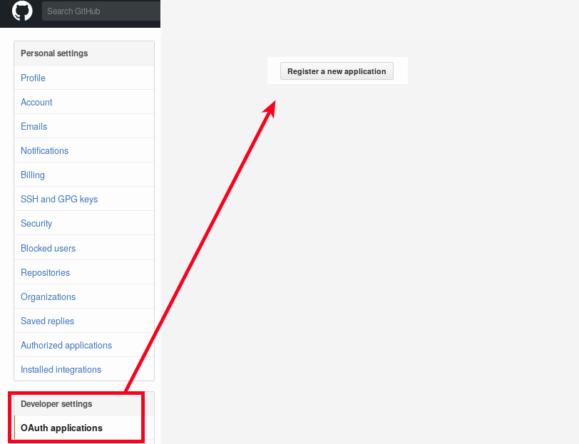
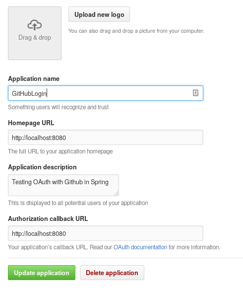
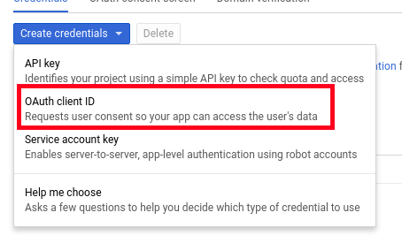
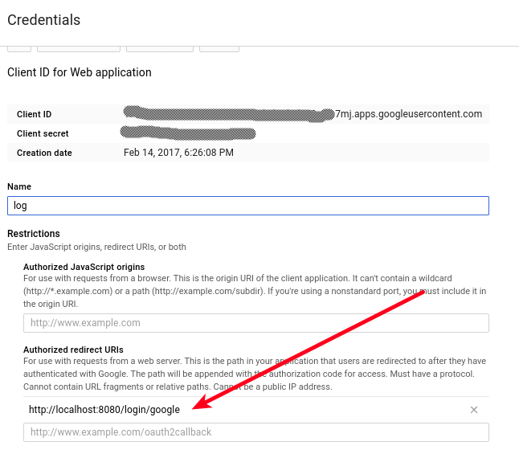

# GitHubLogin
Exemple de ús de login social fent servir diferents proveïdors de OAuth2: 

L'he deixat tant senzill com he pogut perquè sigui fàcil d'entendre però que no sigui massa complicat afegir altres proveïdors

### GitHub
GitHub OAuth des de Spring Boot

En el compte de Github es crea una aplicació:

i s'omple la configuració de l'aplicació. En el meu cas és com aquesta:

Només cal copiar la clau i el secret que ha donat (estan per sobre).

Només cal definir la configuració adequada en application.yml amb les dades de client i secret correctes: 

    github:
    client:
        clientId: XXXXXXXXXXX
        clientSecret: XXXXXXXXXXXXXXXXXXXXXXX
        accessTokenUri: https://github.com/login/oauth/access_token
        userAuthorizationUri: https://github.com/login/oauth/authorize
        clientAuthenticationScheme: form
    resource:
    userInfoUri: https://api.github.com/user

### Google
Per poder fer servir el OAuth2 de Google s'ha d'accedir a la [consola de desenvolupadors](https://console.developers.google.com), s'hi crea un projecte nou.

En l'apartat de credencials es registra una credendencial OAuth Client ID:

Després s'omplen les dades: 

És important definir la URL de redirecció i que coincideixi amb la que fem servir, */login/google*, perquè sinó denegarà l'accés.

En el mateix lloc es pot veure que hi ha un JSON que es pot descarregar que diu quin és el contingut a emplenar en la configuració. En el meu cas:

    google:
    client:
        clientId: xxxx.apps.googleusercontent.com
        clientSecret: xxxxxxxxxxxxxxxx
        accessTokenUri: https://accounts.google.com/o/oauth2/token
        userAuthorizationUri: https://accounts.google.com/o/oauth2/auth
        authenticationScheme: query
        scope:
        - email
        - profile
    resource:
        userInfoUri: https://www.googleapis.com/oauth2/v2/userinfo

### Twitter

WORK In progress